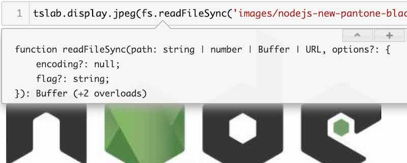
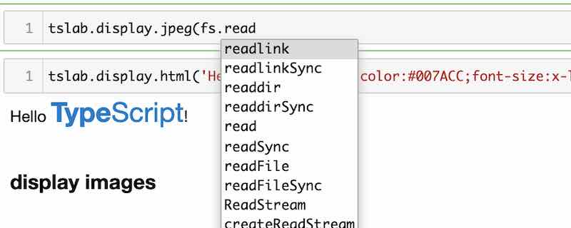

# tslab

[](https://travis-ci.org/yunabe/tslab)
[](https://mybinder.org/v2/gh/yunabe/tslab-examples/master?filepath=notebooks%2Fgetting_started.ipynb)
[](https://www.npmjs.com/package/tslab)

tslab is an interactive programming environment and REPL with Jupyter for JavaScript and TypeScript users.
You can write and execute JavaScript and TypeScript interactively on browsers and save results as Jupyter notebooks.

## Features

- Interactive JavaScript and TypeScript programming with [Jupyter](https://jupyter.org/) and [Node.js](https://nodejs.org/).
- The power of types from [TypeScript project](https://www.typescriptlang.org/).
  - Type safety even in JavaScript mode.
  - Rich code completion and code inspection thanks to types.
- Display non-text contents like images, HTML, JavaScript, SVG, etc...
- Interactive deep neural network machine learning ([TensorFlow.js](https://www.tensorflow.org/js/guide/nodejs)) and data exploration with JavaScript.
- JavaScript is [40x faster than Python](https://www.google.com/search?hl=en&q=python3+node.js+performance).
- TypeScript 5.0 support.
- Top-level [`await`](https://developer.mozilla.org/en-US/docs/Web/JavaScript/Reference/Operators/await) support.
- REPL console support.

### Screenshots: Code inspection (Shift-Tab) and completion (Tab)

<div></div>
<div></div>

## Try tslab without installing it

[](https://mybinder.org/v2/gh/yunabe/tslab-examples/master?filepath=notebooks%2Fgetting_started.ipynb)

Thanks to [binder (mybinder.org)](https://mybinder.org/), you can try tslab on your browsers without installing it into your system.
Open a temporary Jupyter Notebook from the button above and enjoy interactive JavaScript and TypeScript programming.

## Example notebooks

To learn what what we can do with JavaScript on Jupyter, view example notebooks in nbviewer.

- [Getting Started](https://nbviewer.jupyter.org/github/yunabe/tslab-examples/blob/master/notebooks/getting_started.ipynb)
- [Getting Started for JavaScript user](https://nbviewer.jupyter.org/github/yunabe/tslab-examples/blob/master/notebooks/getting_started_javascript.ipynb)
- [Deep Learning with TensorFlow.js](https://nbviewer.jupyter.org/github/yunabe/tslab-examples/blob/master/notebooks/tensorflow.ipynb)

If nbviewer is down, please view the notebooks on GitHub instead.

- [Getting Started](https://github.com/yunabe/tslab-examples/blob/master/notebooks/getting_started.ipynb)
- [Getting Started for JavaScript user](https://github.com/yunabe/tslab-examples/blob/master/notebooks/getting_started_javascript.ipynb)
- [Deep Learning with TensorFlow.js](https://github.com/yunabe/tslab-examples/blob/master/notebooks/tensorflow.ipynb)

## Installing tslab

### Prerequisites

- Install [Node.js](https://nodejs.org/) (LTS or Current)
- Install [Python3.x](https://www.python.org/downloads/)
  - tslab works with Jupyter on Python2.7.
  - But I recommend you to use Jupyter on Python3.x because
    [the latest Jupyter does not support Python2.7](https://ipython.readthedocs.io/en/stable/whatsnew/version6.html)
- Install the latest version of [JupyterLab or Jupyter Notebook](https://jupyter.org/install)

### Installing tslab

First, install `tslab` with `npm`.

```shell
npm install -g tslab
```

Please make sure `tslab` command is available in your terminal.

```
tslab install --version
```

Then, register `tslab` to your Jupyter environment.

```shell
tslab install [--python=python3]
```

By default, tslab is registered with `python3` in unix-like system and `python` in Windows.
If Jupyter is installed with a different Python in your system, please specify the python command with `--python` flag.

After you run `tslab install`, please check two kernels (jslab and tslab) are installed properly to jupyter.

```shell
$ jupyter kernelspec list
Available kernels:
  jslab      /usr/local/google/home/yunabe/.local/share/jupyter/kernels/jslab
  tslab      /usr/local/google/home/yunabe/.local/share/jupyter/kernels/tslab
```

### Usage: JupyterLab and Jupyter Notebook

After you register `tslab` to Jupyter, start JupyterLab and Jupyter Notebook as usual. You can now create JavaScript and TypeScript notebooks.

```shell
# JupyterLab
# `--port=` to change the port to accept connections.
# `--ip=0.0.0.0` to accept external connections.
jupyter lab [--port=8888] [--ip=0.0.0.0]

# Jupyter Notebook
jupyter notebook
```

In Jupyter, you can complete code by pressing `Tab` and show tooltips by pressing `Shift + Tab`.

### Usage: REPL console

You can also use tslab and Jupyter as an interactive console (REPL).
To use tslab as REPL, please run `jupyter console` with `--kernel=jslab` (JavaScript) or `--kernel=tslab` (TypeScript).

```shell
jupyter console --kernel=tslab
```

## Clarification

tslab is an interactive JavaScript and TypeScript programming environment on Node.js (aka Server-side JavaScript).
tslab does not support code execution on browsers (aka Client-side JavaScript) at this moment.

## Read more

- [Advanced topics](docs/advanced.md)
- [Developing tslab](docs/developing.md)
- [Internal design](docs/internal.md)
